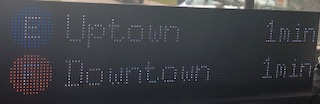

# RPI-Subway-LED-Matrix

This is a fun little raspberry pi project that pulls subway data from the NYC MTA and displays them on an LED Matrix board. I wanted different subway lines (AE) and (DFM) to show up so this is not a true subway display where it shows a upcoming times for one line, though it would be very easy to add.

## Hardware
* Raspberry Pi 3
* Adafruit Hat
* 2x 32x64 Led Matrix Boards - Hub75 - from Aliexpress
* 40Amp PSU amazon

## NYC MTA API Key
You will need to signup for a developer account with the NYC MTA
https://datamine.mta.info/

## NYC Stations
Find the station ID you want times from. The locations I chose have a N-North and S-South that is added to the station ID
[http://web.mta.info/developers/data/nyct/subway/Stations.csv](http://web.mta.info/developers/data/nyct/subway/Stations.csv)

## LED MATRIX CONFIGURATION
I followed the [HZELLER LED Matrix](https://github.com/hzeller/rpi-rgb-led-matrix/) Python setup.
The following configurations are pre-set in the samplebase.py script because I could not figure out how to set them in the script.
* brightness = 50
* gpio-slowdown = 3
* column=64
* rows=32
* chain=2

## Github Repos Used:
Hzeller RPI Led Matrix
[https://github.com/hzeller/rpi-rgb-led-matrix/](https://github.com/hzeller/rpi-rgb-led-matrix/)

Learned how to build the subway logos from this script
[https://github.com/jungckjp/subway-times](https://github.com/jungckjp/subway-times)

Great script on how to access the MTA API and parse times
[https://github.com/lightalan/subwayclock](https://github.com/lightalan/subwayclock)

